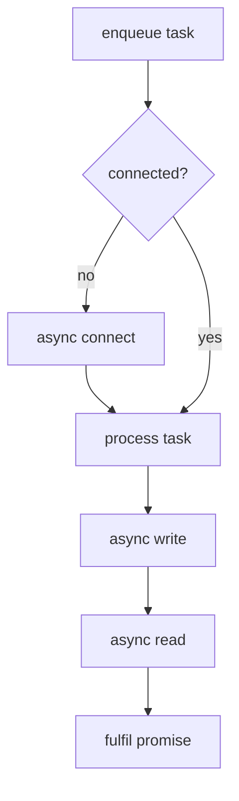

# Async REST Client – Architectural Planning

## Purpose

Design an asynchronous, coroutine-based REST client built on **Boost.Beast** and **Boost.Asio** that seamlessly integrates with the project's single-threaded Proactor architecture. The client will be flexible, extensible, and aligned with the project's coding, logging, and architectural standards.

## High-Level Requirements

1. **Connection Management**
   • Explicit `connect(url)` API allowing callers to establish a TCP/SSL connection in advance.<br/>
   • Implicit connection when the first HTTP verb method is invoked.
   • Automatic host switching: if a request targets a different host, gracefully shut down the existing connection, then connect to the new host.
   • **Dynamic HTTP/HTTPS** — the client inspects the URL scheme (`http` vs `https`) and configures the underlying stream accordingly. A single `boost::asio::ssl::context _ssl_ctx{ssl::context::tlsv12_client};` is maintained by the client and reused for all TLS sessions.
2. **HTTP Verb Support (v0)**
   • `get` – request body always `http::empty_body`, templated response body.<br/>
   • `post` – templated request/response bodies (limited initially to `http::string_body` + `http::empty_body`).
   • Additional verbs (`put`, `delete_`, etc.) will be added incrementally.
3. **Task Queue**
   • Each outgoing request is represented by a *task* object containing all state required for processing the request/response cycle.
   • Tasks are processed **strictly sequentially** on the project-wide `io_context`; only the task at the front of the queue is active at any time.
   • If a user invokes another HTTP verb while a task is in flight, the new task is **enqueued** and will run automatically when previous tasks finish—callers simply `co_await` the returned result.
   • `std::deque<std::unique_ptr<base_task>> _tasks;` is used as the work-queue container.
4. **Type Safety & Extensibility**
   • Templated verb methods constrained with **concepts** to accept only supported *Beast body* types at compile time.
   • Easy to extend by widening the concept's accepted types.
5. **URL Handling**
   • Reliance on `boost::url` – no manual parsing; host/port/scheme/target extracted via the API.
6. **Error Handling**
   • No automatic retries in v0 – failures propagate via exceptions.
7. **Logging**
   • Conform to project logging standards using `LOG_INFO/ERROR/DEBUG` macros.

## Core Types

```
class async_rest_client : public std::enable_shared_from_this<async_rest_client>
{
    // public API
    void connect(const std::string &url);

    template <typename ResponseBody>
    http::response<ResponseBody> get(const std::string &url,
                                     const http::fields &headers = {});

    template <typename RequestBody, typename ResponseBody>
    http::response<ResponseBody> post(const std::string &url,
                                      const http::fields &headers,
                                      std::string body);
    // … other verbs

    // implementation details …
};
```

### Internal `task` Struct (v0)

| Field | Purpose |
|-------|---------|
| `boost::url endpoint` | Fully parsed request URL |
| `http::verb verb` | HTTP verb for the request |
| `std::function<void()> resume_coroutine` | Captures awaiting coroutine handle |
| `std::function<void(http::error_code)> on_error` | Error propagation |
| `ReqBody::value_type request_payload` | Payload (empty for `http::empty_body`)|
| `std::promise<http::response<ResBody>> result` | Result propagation |
| `(optional) http::fields headers` | User-supplied headers |

> NOTE: Exact fields may evolve; the goal is self-contained encapsulation of request/response state.

#### Polymorphic Task Abstraction

```cpp

namespace beast     = boost::beast;
namespace http      = beast::http;
namespace websocket = beast::websocket;
namespace net       = boost::asio;
namespace ssl       = boost::asio::ssl;
using tcp           = boost::asio::ip::tcp;

template<typename T>
concept SupportedStreamType = std::is_same<http::tcp_stream> || std::is_same<http::ssl_stream<http::tcp_stream>>

template<SupportedStreamType StreamType>
struct connection_context {
    StreamType &stream;
    boost::beast::flat_buffer &buffer;
};

using https_connection_context = connection_context<http::ssl_stream<http::tcp_stream>>;
using http_connection_context = connection_context<http::tcp_stream>;


struct base_task {
    virtual ~base_task() = default;
    // Executes the request/response coroutine using the provided connection resources.
    virtual bool run(http_connection_context &ctx) = 0;
    virtual bool run(https_connection_context  &ctx) = 0;
};

template <typename ReqBody, typename ResBody>
requires SupportedRequestBody<ReqBody> && SupportedResponseBody<ResBody>
class typed_task final : public base_task {
public:
    typed_task(boost::url endpoint,
               http::verb verb,
               http::fields headers,
               typename ReqBody::value_type request_payload);

    bool run(http_connection_context  &ctx) override;
    bool run(https_connection_context &ctx) override;

    // Expose caller-side future before task execution begins.
    std::shared_future< http::response<ResBody> > get_shared_future() {
        return _promise.get_future().share();
    }
private:
    template <SupportedStreamType Stream>
    bool run_impl(Stream &stream, boost::beast::flat_buffer &buffer);

    std::promise< http::response<ResBody> > _promise;
    // internal state as needed …
};
```

The client enqueues `std::unique_ptr<base_task>` objects, achieving **type erasure** while retaining the compile-time safety of the templated `typed_task` implementation. Depending on the active transport, the client constructs either `connection_context_plain` or `connection_context_ssl` and invokes `task->run(ctx)`. Each override forwards to a common templated `run_impl<Stream>()`, ensuring zero duplication of business logic while preserving static type safety.

## Coroutine Flow



* All operations are `co_await`-driven; the awaiting public API coroutine resumes when the promise is fulfilled.

## Connection Lifecycle

1. `DISCONNECTED` → `CONNECTING` → `CONNECTED`.
2. On host change request: transition to `DISCONNECTING` → `DISCONNECTED` → follow normal connect flow.
3. Graceful SSL/TCP shutdown using the Beast stream's `async_shutdown` followed by socket close.

## Compile-Time Body Constraints

```cpp
// Pseudocode concept definition
template <typename Body>
concept SupportedRequestBody = std::same_as<Body, http::empty_body> ||
                               std::same_as<Body, http::string_body>;

template <typename Body>
concept SupportedResponseBody = std::same_as<Body, http::string_body>;
```

Instantiating verb methods with unsupported body types yields **clear** compiler diagnostics.

## Test Strategy

Leverage [`httpbin.org`](https://httpbin.org/) for integration tests. Endpoints such as `/get`, `/post`, `/anything`, and `/redirect` cover:
• header echoing
• JSON/string body round-trip
• various HTTP verbs
• redirection handling.

## Project Plan (Incremental Implementation Road-map)

This client will live in `async_rest_client/` as an **independent static library** with its own `CMakeLists.txt`; the trading-bot binary links against it.  Work will proceed in small, testable slices:

### Milestone 0 – Build Scaffold

1. Add `async_rest_client/CMakeLists.txt` producing `libasync_rest_client.a` and expose headers under `include/async_rest_client/`.
2. Update root `CMakeLists.txt` to add the subdirectory and link the library into existing targets.
3. Create an empty `async_rest_client.hpp` umbrella header and build successfully.

### Milestone 1 – Core Type Definitions

1. Implement `connection_context`, `base_task`, `typed_task` headers (no functionality yet).
2. Compile unit tests that simply instantiate these types.

### Milestone 2 – Connection & Stream Layer

1. Add member streams (`tcp_stream`, `ssl_stream`) and `_ssl_ctx` to the client class.
2. Implement `connect(url)` coroutine:
   • DNS resolve → TCP connect
   • **If** `scheme == "https"` → perform `ssl_stream::async_handshake` (TLS handshake).
3. Unit-test with `boost::beast::test::stream` for plain HTTP; HTTPS will be verified later via real integration tests or a dedicated in-process SSL test harness (maybe a python script).

### Milestone 3 – Task Queue Engine

1. Introduce `_tasks` deque, `_is_request_in_progress` flag
2. Implement `process_queue()` coroutine

### Milestone 4 – HTTP GET Support

1. Flesh out `typed_task::run_impl` for `ReqBody = http::empty_body`.
2. Expose `awaitable<response<string_body>> get(url, headers)`.

### Milestone 5 – HTTP POST Support

1. Extend body support to `string_body` for requests.
2. Expose `post<RequestBody, ResponseBody>()` overload.

### Milestone 6 – Host Switching & Re-connect Logic

1. Detect host mismatch, perform shutdown, clear buffer, reconnect.
2. Add tests that issue sequential requests to different hosts.

### Milestone 7 - Implement Unit Tests
1. Test public facing API
2. Write tests for `get()` using `httpbin.org/get`
3. Write tests for `post()` using `httpbin.org/post`
4. Ensure that these functions work correctly in a wide variety of contexts
5. Ensure that queueing works
6. Ensure that mixed host requests in queue switch connections properly
7. Ensure that headers actually sent are what we expect
8. Ensure that response object that we receive is exactly what we expect
9. Test some failure scenarios to ensure that client handles failures correctly
10. Remove current testing suite that is way too simple and implicitly tested by the above tests

### Milestone 8 – Cleanup & Documentation

1. Address TODOs (timeouts, retry policy stubs).
2. Add Doxygen comments, logging calls, README updates.

Each milestone compiles and its unit tests pass (`./build.sh Debug async_rest_client_tests`).  Integration tests against httpbin can be gated behind an environment variable to avoid network during CI.

---
*Document version: v0.3 – added Project Plan and static-library note*

## Dynamic Stream Type Handling

With **two explicit connection context types**, the transport selection moves up to the client:

1. `async_rest_client` always owns *both* a `tcp_stream` and an `ssl_stream<tcp_stream>`, along with a shared flat buffer.
2. On `connect(url)`, the client determines whether to use TLS and performs the appropriate handshake.
3. Before running a task, the client constructs the matching context object (`connection_context_plain` or `connection_context_ssl`) and dispatches the task.

This approach eliminates the need for `std::variant` and `std::visit` while keeping the public API non-templated. Adding additional transports would require adding another context type and corresponding `run` overload.

## Result Propagation & Public API Contract

Each verb method returns a `boost::asio::awaitable<http::response<ResBody>>` (or `std::future` when using `co_spawn`). Internally the `typed_task` owns a `std::promise` fulfilled by `run_impl` once `async_read` completes. Public callers simply `co_await` the verb call—if their task is queued behind others, the coroutine will suspend until its promise is fulfilled, providing natural back-pressure without extra locking constructs.

`task_status` is a simple, non-templated enum that lets the client loop know whether a task finished normally (`success`) or prematurely due to an exception / I/O error (`failure`). The actual **HTTP response object** is delivered to the caller via a `std::promise`/`std::shared_future` that is a member of `typed_task` *templated on the concrete `ResBody`*. Because the future is obtained by the public verb method *before* the task is enqueued, callers have a strongly typed future/awaitable without the queue needing to know the body type.

Flow:

1. Public API (`get`, `post`, …) creates `typed_task<ReqBody, ResBody>` and captures `std::shared_future< http::response<ResBody> >` from the internal promise.
2. Task is pushed to `_tasks` and processing loop started if idle.
3. When the task reaches the front and its `run` executes, it calls `run_impl` which performs `async_write` / `async_read`, builds `http::response<ResBody>` and sets the promise.
4. The caller's coroutine, which is `co_await`ing the future, resumes with the fully typed response.
5. The `task_status` returned from `run` is used only for bookkeeping (e.g. decide whether to pop the task and move to next).

```cpp
// ---- Result propagation pseudocode ----

// Public GET API (inside async_rest_client)
template<typename ResponseBody>
awaitable< http::response<ResponseBody> > async_rest_client::get(
        std::string url, const http::fields &hdrs)
{
    // 1. Construct task and capture its future
    auto task = std::make_unique< typed_task<http::empty_body, ResponseBody> >(
                    boost::url{url}, http::verb::get, hdrs, http::empty_body::value_type{});

    auto fut = task->get_shared_future(); // std::shared_future<http::response<ResponseBody>>

    // 2. Enqueue and maybe start processing loop
    _tasks.push_back(std::move(task));
    if (!_processing)
        co_await co_spawn(_ioc, process_queue(), detached);

    // 3. Suspend until the promise is fulfilled
    co_return co_await boost::asio::use_awaitable_t<>::awaitable(fut);
}

// Processing loop (runs inside the io_context)
awaitable<void> async_rest_client::process_queue()
{
    _processing = true;
    while (!_tasks.empty()) {
        auto &tsk = *_tasks.front();
        task_status ok;
        if (is_tls()) {
            https_connection_context ctx{_ssl_stream, _buffer};
            ok = co_await tsk.run(ctx);
        } else {
            http_connection_context ctx{_tcp_stream, _buffer};
            ok = co_await tsk.run(ctx);
        }
        _tasks.pop_front();
        if (!ok) break; // decide how to propagate error
    }
    _processing = false;
    co_return;
}

// In typed_task – coroutine body simplified
template<SupportedStreamType Stream>
bool typed_task::run_impl(Stream &s, beast::flat_buffer &buf)
{
    try {
        // 1. Build the request object once; its lifetime spans both operations
        http::request<ReqBody> req{_verb, _endpoint.target(), 11};
        req.set(http::field::host, _endpoint.host());
        req.set(http::field::user_agent, BOOST_BEAST_VERSION_STRING);
        req.fields().insert(_headers.begin(), _headers.end());
        req.body() = _request_payload; // empty for http::empty_body
        req.prepare_payload();

        // 2. Write the request
        co_await http::async_write(s, req, use_awaitable);

        // 3. Declare response object outside async_read so it lives until completion.
        //    After async_read returns, its header+body are fully owned by `res`; the
        //    parser has copied the data, so we can safely clear the shared buffer.
        http::response<ResBody> res;
        co_await http::async_read(s, buf, res, use_awaitable);
        buf.consume(buf.size()); // reset buffer for next request

        // 4. Fulfil promise
        _promise.set_value(std::move(res));
        co_return true;
    } catch(const std::exception &e) {
        _promise.set_exception(std::current_exception());
        co_return false;
    }
}
```

Key ideas:
• The *future* is retrieved *before* enqueuing the task, giving the caller a strongly typed awaitable.
• The processing loop selects the correct connection context and `co_await`s the task's `run` coroutine.
• `typed_task` fulfils its own promise; callers resume with the `http::response<Body>` they expect.
• `task_status` is simply a `bool` signalling success (`true`) or failure (`false`) so the loop can handle shutdown/error propagation cleanly.

## Additional Design Notes

### Buffer lifetime & safety

• Boost.Beast copies header strings and body data into the `http::response` object during parsing; they do **not** hold references into the `flat_buffer` after `async_read` returns.  Therefore calling `buf.consume(buf.size())` immediately after the read is safe and prevents residual bytes leaking into the next response.

### Connection persistence & host switching

• Every request is sent with the default HTTP/1.1 `Connection: keep-alive` (we omit any user-supplied `Connection` header to avoid accidental closure).
• On host change we perform: `async_shutdown()` (TLS only) → socket close → buffer reset → fresh DNS resolve + connect + (optional) SSL handshake.

### Future extensibility placeholder

• A `request_options` struct (url, timeout, retry-count …) can be added later and threaded through `connect` / verb methods without modifying the core task mechanism.

### Error propagation policy

• If a task throws, the promise associated with that task carries the exception to the caller.
• The processing loop **continues** with the remaining tasks; callers choose whether to catch or let it crash the application.

### Resolver usage

• A fresh `async_resolve` is issued on every (re)connect to avoid stale IPs.

### Threading guarantee

• All public methods must be called on the same thread that runs the trading-bot's single `io_context`.  No internal locking is required.

### Testing strategy update

• For deterministic unit tests we can substitute Beast's `boost::beast::test::stream` in place of the real TCP/SSL stream inside a derived `async_rest_client_test` harness, enabling scripted request/response sequences.  Real-integration tests will still target httpbin.org.
